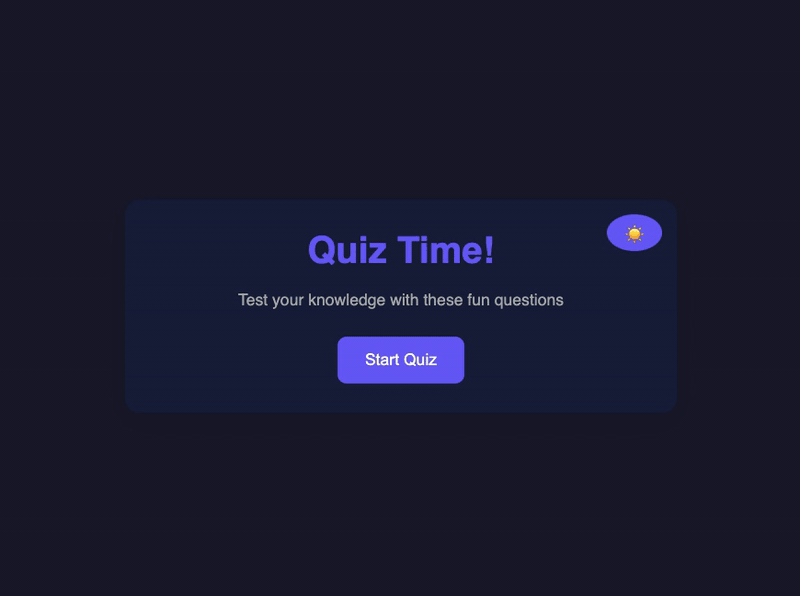

# Quiz Game

A simple, interactive quiz game built with vanilla HTML, CSS, and JavaScript.

## Demo



## Features

- 5 multiple-choice questions covering general knowledge
- Real-time score tracking
- Visual feedback for correct/incorrect answers
- Progress bar showing quiz completion
- Responsive design for all screen sizes
- Performance-based result messages

## How to Run

Simply open `index.html` in your web browser.

## Project Structure

```
.
├── index.html    # main HTML structure
├── style.css     # styling and responsive design
├── script.js     # quiz logic and interactivity
└── demo.gif     # demo recording
```

## Technologies Used

- HTML5
- CSS3
- JavaScript (ES6+)
