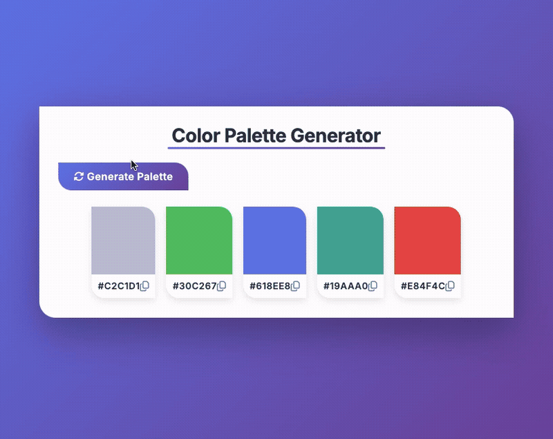

# Color Palette Generator

A beautiful, interactive color palette generator built with vanilla HTML, CSS, and JavaScript.

## Demo



## Features

- Generate random color palettes with a single click
- Copy hex color codes by clicking on color boxes or copy icons
- Visual feedback with checkmark animation when colors are copied
- Flexbox-based responsive layout that centers items beautifully
- Modern UI with asymmetric border radius design (top-right and bottom-left)
- Smooth hover animations and transitions
- CSS variables for consistent theming
- Mobile-friendly with centered button on small screens

## How to Run

Simply open `index.html` in your web browser.

## Project Structure

```
.
├── index.html    # main HTML structure
├── style.css     # styling with CSS variables and responsive design
├── script.js     # color generation and clipboard functionality
└── demo.gif      # demo recording
```

## Technologies Used

- HTML5
- CSS3 (Flexbox, CSS Variables, Custom Properties)
- JavaScript (ES6+)
- Clipboard API for copy functionality
- Font Awesome icons
- Inter font family
