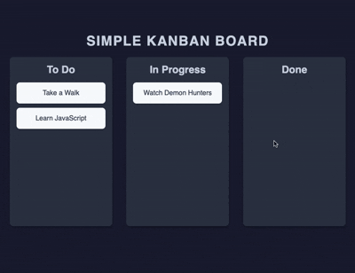

# Drag & Drop Board

A simple Kanban-style board with drag-and-drop functionality built with vanilla HTML, CSS, and JavaScript.

## Demo



## Features

- Drag and drop cards between lists (To Do, In Progress, Done)
- Visual feedback on drag (cursor change, card scaling)
- List hover effect when dragging over drop zones
- Dark theme with modern color scheme
- Responsive design for mobile devices
- CSS variables for easy theming

## How to Run

Simply open `index.html` in your web browser.

## Project Structure

```
.
├── index.html    # main HTML structure
├── style.css     # styling with CSS variables and dark theme
├── script.js     # drag-and-drop functionality
└── demo.gif      # demo recording
```

## Technologies Used

- HTML5 Drag and Drop API
- CSS3 (Flexbox, CSS Variables, Transitions)
- JavaScript (ES6+)
