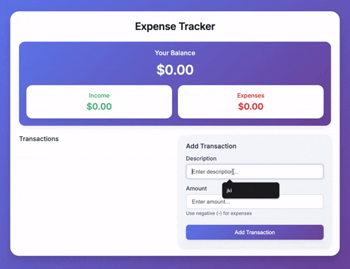

# Expense Tracker

A modern expense tracking application built with vanilla HTML, CSS, and JavaScript featuring localStorage persistence and real-time balance calculations.

## Demo



## Features

- Add income and expense transactions with descriptions and amounts
- Real-time balance calculation with separate income/expense totals
- Delete transactions with visual feedback
- Data persistence using localStorage
- Smooth animations and transitions
- Modern purple/blue gradient theme
- Responsive design for mobile and desktop
- Clean, compact UI with Inter font

## How to Run

Simply open `index.html` in your web browser.

## Project Structure

```
.
├── index.html    # main HTML structure
├── style.css     # styling with CSS variables and responsive design
├── script.js     # transaction management and localStorage
└── demo.gif      # demo recording
```

## Technologies Used

- HTML5
- CSS3 (Grid, Flexbox, CSS Variables, Animations)
- JavaScript (ES6+)
- localStorage API for data persistence
- Intl.NumberFormat for currency formatting
- Inter font family

## Key Functionality

- **Add Transactions**: Enter description and amount (negative for expenses)
- **Delete Transactions**: Click the 'x' button on any transaction
- **Automatic Calculations**: Balance, income, and expenses update in real-time
- **Data Persistence**: All transactions saved to localStorage automatically
- **Responsive Layout**: Two-column desktop layout, single-column mobile
