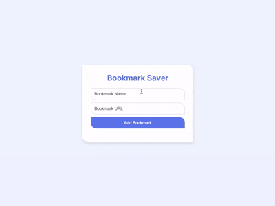

# Bookmark Saver

A clean and modern bookmark management application built with vanilla HTML, CSS, and JavaScript featuring localStorage persistence and URL validation.

## Demo



## Features

- Add bookmarks with custom names and URLs
- Automatic URL validation (requires http:// or https://)
- Delete bookmarks with a single click
- Data persistence using localStorage
- Modern purple/blue gradient theme
- Asymmetric border radius design (top-right & bottom-left corners)
- Smooth animations and hover effects
- Clean, compact UI with Inter font

## How to Run

Simply open `index.html` in your web browser.

## Project Structure

```
.
├── index.html    # main HTML structure
├── style.css     # styling with CSS variables and asymmetric design
├── script.js     # bookmark management and localStorage
└── demo.gif      # demo recording
```

## Technologies Used

- HTML5
- CSS3 (Flexbox, CSS Variables, Transitions)
- JavaScript (ES6+)
- localStorage API for data persistence
- Inter font family

## Key Functionality

- **Add Bookmarks**: Enter name and URL, automatically validated
- **Delete Bookmarks**: Click "Remove" button on any bookmark
- **Data Persistence**: All bookmarks saved to localStorage automatically
- **URL Validation**: Ensures all URLs start with http:// or https://
- **Asymmetric Design**: Unique border radius pattern (0 20px 0 20px)
