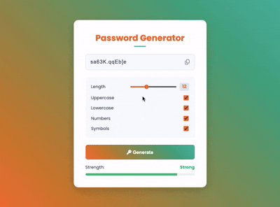

# Password Generator

A customizable, secure password generator with real-time strength estimation built with vanilla HTML, CSS, and JavaScript.

## Demo



## Features

- Customizable password length (6-24 characters)
- Character type options: Uppercase, Lowercase, Numbers, Symbols
- Real-time password strength meter with color-coded feedback
- One-click copy to clipboard with visual confirmation
- Automatic password generation on page load
- Modern orange/teal gradient theme
- Clean, responsive UI with Poppins font

## How to Run

Simply open `index.html` in your web browser.

## Project Structure

```
.
├── index.html        # main HTML structure
├── style.css         # styling with CSS variables and gradients
├── script.js         # password generation and strength calculation
└── demo.gif          # demo recording
```

## Technologies Used

- HTML5
- CSS3 (CSS Variables, Gradients, Transitions)
- JavaScript (ES6+, Arrow Functions, Array Methods, Ternary Operators)
- Clipboard API for copy functionality
- Font Awesome icons
- Poppins font family

## Password Strength Calculation

- **Base Score**: 2 points per character (capped at 40)
- **Uppercase Letters**: +15 points
- **Lowercase Letters**: +15 points
- **Numbers**: +15 points
- **Symbols**: +15 points
- **Minimum Length Penalty**: Passwords shorter than 8 characters are capped at 40 points

**Strength Levels:**
- **Weak** (0-39): Red indicator
- **Medium** (40-69): Amber indicator
- **Strong** (70+): Green indicator
