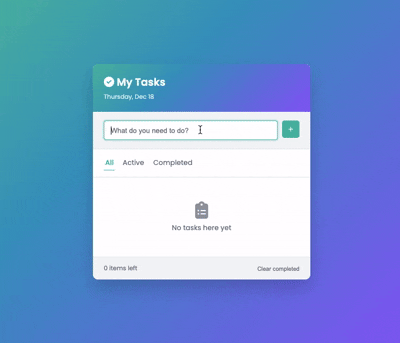

# Todo App

A modern, minimalist todo application with filtering and local storage built with vanilla HTML, CSS, and JavaScript.

## Demo



## Features

- Add, complete, and delete tasks
- Filter tasks by All, Active, or Completed status
- Persistent storage using localStorage
- Live task counter showing active items
- Clear all completed tasks with one click
- Current date display
- Clean teal/purple gradient theme
- Responsive UI with Poppins font

## How to Run

Simply open `index.html` in your web browser.

## Project Structure

```
.
├── index.html        # main HTML structure
├── style.css         # styling with CSS variables and gradients
├── script.js         # todo logic with localStorage
└── demo.gif          # demo recording
```

## Technologies Used

- HTML5
- CSS3 (CSS Variables, Gradients, Transitions)
- JavaScript (ES6+, Arrow Functions, Ternary Operators, Template Literals)
- LocalStorage API for data persistence
- Font Awesome icons
- Poppins font family

## Features Detail

- **Add Tasks**: Type and press Enter or click the + button
- **Complete Tasks**: Click the checkbox to toggle completion
- **Delete Tasks**: Hover over a task and click the × button
- **Filter**: Switch between All, Active, and Completed views
- **Persistence**: All tasks are saved to localStorage automatically
