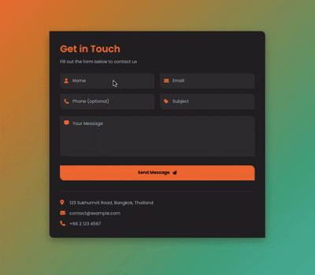

# Contact Form

A modern, responsive contact form with asymmetric design elements built with vanilla HTML and CSS.

## Demo



## Features

- Clean, modern contact form design
- Asymmetric border-radius styling (top-right & bottom-left)
- Orange/teal gradient background theme
- Icon-enhanced input fields
- Responsive grid layout for input fields
- Smooth hover animations
- Contact information display
- Mobile-responsive design
- Poppins font family

## How to Run

Simply open `index.html` in your web browser.

## Project Structure

```
.
├── index.html        # main HTML structure
├── style.css         # styling with CSS variables and animations
└── demo.gif          # demo recording
```

## Technologies Used

- HTML5
- CSS3 (CSS Variables, Grid Layout, Animations, Gradients)
- Font Awesome icons
- Poppins font family

## Form Fields

- **Name**: Required text field
- **Email**: Required email field with validation
- **Phone**: Optional telephone field
- **Subject**: Required text field
- **Message**: Required textarea field

## Design Features

- **Asymmetric Border Radius**: All inputs, textarea, button, and container use `border-radius: 0 16px 0 16px` (top-right & bottom-left corners only)
- **Gradient Background**: Orange to teal diagonal gradient
- **Dark Theme**: Dark card background with light text for contrast
- **Icon Integration**: Font Awesome icons positioned inside each input field
