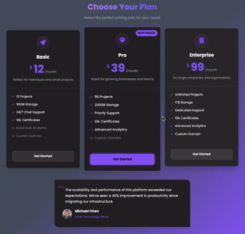

# Pricing Cards

A modern, responsive pricing cards layout with gradient background built with vanilla HTML and CSS.

## Demo



## Features

- Three-tier pricing plans (Basic, Pro, Enterprise)
- Highlighted "Most Popular" card with scaling effect
- Purple/pink gradient background theme
- Animated hover effects on cards
- Pulsing animation on featured button
- Icon-based feature lists with check/times indicators
- Responsive grid layout
- Customer testimonial section
- Mobile-responsive design
- Poppins font family

## How to Run

Simply open `index.html` in your web browser.

## Project Structure

```
.
├── index.html        # main HTML structure
├── style.css         # styling with CSS variables and animations
└── demo.gif          # demo recording
```

## Technologies Used

- HTML5
- CSS3 (CSS Variables, Grid Layout, Animations, Gradients, Transforms)
- Font Awesome icons
- Poppins font family

## Pricing Plans

- **Basic** - $9/month: 5 Projects, 20GB Storage, Basic Support
- **Pro** - $29/month (Most Popular): 15 Projects, 100GB Storage, Priority Support, Advanced Analytics
- **Enterprise** - $79/month: Unlimited Projects, 500GB Storage, 24/7 Support, All Features

## Design Features

- **Purple/Pink Gradient**: Diagonal gradient from purple (#a855f7) to pink (#ec4899)
- **Card Hover Effects**: Cards lift up (-10px) with enhanced shadow on hover
- **Popular Badge**: Special scaling effect (1.05x) on Pro plan card
- **Pulse Animation**: Continuous pulsing glow on Pro plan button
- **Icon Badges**: Circular gradient backgrounds for plan icons
