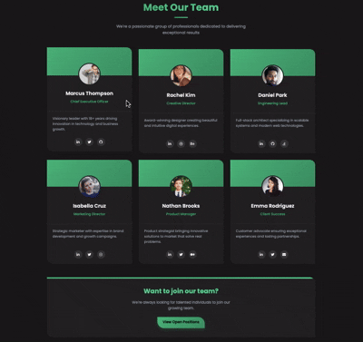

# Team Members Showcase

A modern, responsive team members showcase with gradient cards built with vanilla HTML and CSS.

## Demo



## Features

- Six team member cards with profile photos
- Gradient background header for each card
- Green gradient theme
- Hover effects with card lift and image zoom
- Social media links with icons
- Asymmetric border-radius design (top-right & bottom-left)
- Call-to-action section
- Responsive grid layout
- Poppins font family

## How to Run

Simply open `index.html` in your web browser.

## Project Structure

```
.
├── index.html        # main HTML structure
├── style.css         # styling with CSS variables and animations
└── demo.gif          # demo recording
```

## Technologies Used

- HTML5
- CSS3 (CSS Variables, Grid Layout, Animations, Gradients, Transforms)
- Font Awesome icons
- Poppins font family
