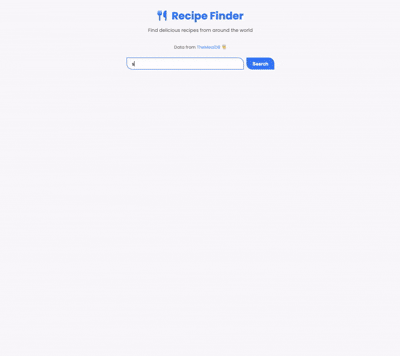

# Recipe Finder

A modern recipe finder application that fetches recipes from TheMealDB API built with vanilla HTML, CSS, and JavaScript.

## Demo



## Features

- Search recipes by keyword
- View recipe cards with images
- Click to view detailed recipe information
- Ingredients list with measurements
- Cooking instructions
- YouTube video links (when available)
- Blue/cyan gradient theme
- Asymmetric border-radius design (top-right & bottom-left)
- Responsive grid layout
- Poppins font family

## How to Run

Simply open `index.html` in your web browser.

## Project Structure

```
.
├── index.html        # main HTML structure
├── style.css         # styling with CSS variables and animations
├── script.js         # API integration and DOM manipulation
└── demo.gif          # demo recording
```

## Technologies Used

- HTML5
- CSS3 (CSS Variables, Grid Layout, Animations, Gradients, Transforms)
- JavaScript (ES6+, Fetch API, Async/Await)
- Font Awesome icons
- Poppins font family
- TheMealDB API
