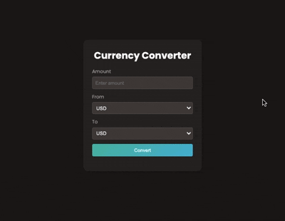

# Currency Converter

A modern currency converter application that fetches live exchange rates from ExchangeRate-API built with vanilla HTML, CSS, and JavaScript.

## Demo



## Features

- Real-time currency conversion
- 160+ currencies supported
- Live exchange rates from ExchangeRate-API
- Teal/cyan gradient theme
- Warm brown/stone dark background
- Simple and intuitive interface
- Responsive design
- Poppins font family

## How to Run

Simply open `index.html` in your web browser.

## Project Structure

```
.
├── index.html        # main HTML structure
├── style.css         # styling with CSS variables
├── script.js         # API integration and conversion logic
└── demo.gif          # demo recording
```

## Technologies Used

- HTML5
- CSS3 (CSS Variables, Gradients, Transitions)
- JavaScript (ES6+, Fetch API, Async/Await)
- Poppins font family
- ExchangeRate-API
