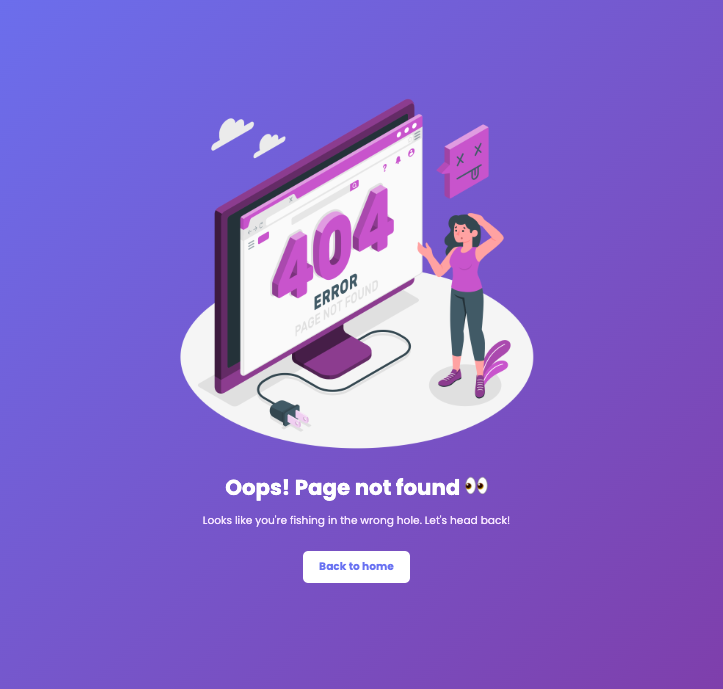

# Custom 404 Page Design

A modern and beautiful custom 404 error page with a purple gradient background built with vanilla HTML and CSS.

## Demo



## Features

- Beautiful purple gradient background
- Custom 404 illustration
- Friendly error message
- Smooth hover animations on button
- Fully responsive design
- Poppins font family
- Clean and minimal design

## How to Run

Simply open `index.html` in your web browser.

## Project Structure

```
.
├── index.html        # main HTML structure
├── style.css         # styling with gradients and animations
├── 404.png           # custom 404 illustration
└── demo.png          # demo screenshot
```

## Technologies Used

- HTML5
- CSS3 (Gradients, Flexbox, Transitions, Transforms)
- Poppins font family

## Credits

- 404 illustration from [Storyset](https://storyset.com/)
