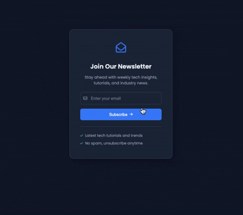

# Newsletter Signup Design

A modern and elegant newsletter signup form with a blue/cyan theme built with vanilla HTML and CSS.

## Demo



## Features

- Clean and modern design
- Blue/cyan gradient theme
- Email input with icon
- Animated subscribe button
- Hover effects on button with arrow slide animation
- Focus states on input fields
- Benefits list with checkmarks
- Fully responsive design
- Poppins font family

## How to Run

Simply open `index.html` in your web browser.

## Project Structure

```
.
├── index.html        # main HTML structure
├── style.css         # styling with CSS variables and animations
└── demo.gif          # demo recording
```

## Technologies Used

- HTML5
- CSS3 (CSS Variables, Flexbox, Transitions, Transforms)
- Font Awesome icons
- Poppins font family
